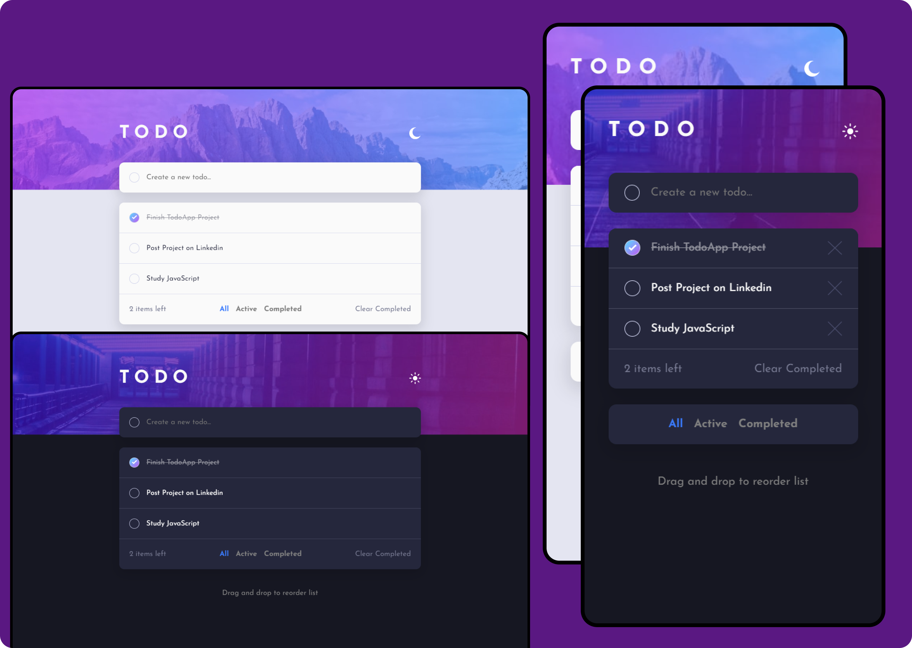

# TodoApp

This project consists in a responsive TodoApp with many functionalities as listed below:

- Theme Toggling
- Adding new todos
- Deleting todos individually
- Checking and unchecking todos
- Reordering todos
- Counter active todos
- Filter through All, Active and Completed todos
- Deleting all completed todos

The project idea and design was proposed by Frontend Mentor and developed by me.

## Screenshot

## This project was developed with

- HTML
- CSS
- JavaScript
- [Sortable Library](https://sortablejs.github.io/Sortable/)

## Author

- [@jv-miranda](https://github.com/jv-miranda)

## Links

